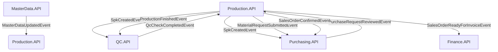

# Arsitektur & Infrastruktur PJT ERP

PJT ERP dirancang dengan arsitektur **Microservices** menggunakan .NET 10 dan PostgreSQL, dengan komunikasi antar layanan menggunakan arsitektur event-driven berbasis PGMQ (PostgreSQL Message Queue).

## Struktur Database & Microservices

Sistem ini memiliki beberapa database terpisah sesuai domain driven design (DDD), sehingga tidak ada coupling database secara langsung antar service.

- `pjt_identity`: Manajemen User dan Role.
- `pjt_masterdata`: Customer dan Produk/Part.
- `pjt_production`: Tracking Sales Order, Assignment Engineer, dan Timeline Produksi.
- `pjt_qc`: Hasil QC Inspeksi (Go/NoGo).
- `pjt_purchasing`: Material Request, Approval berjenjang (Supervisor & Finance), PO, dan Stok.
- `pjt_finance`: Invoice (DP/Pelunasan), Verifikasi Pembayaran (Indikator Lunas/Belum), Dashboard Finance.
- `pjt_eventbus`: Infrastruktur PGMQ untuk event asinkron.
- `pjt_cache`: Distributed cache berbasis PostgreSQL.

> [!WARNING]
> **Aturan Soft Reference:**
> Anda **tidak diperbolehkan** menggunakan Foreign Key fisik (relasi langsung) antar database yang berbeda. 
> Contoh: Kolom `Production.sales_orders.customer_id` hanya menyimpan ID referensi (soft reference) ke `MasterData.customers.id`. Validasi konsistensi dilakukan di tingkat aplikasi dan melalui event bus, bukan melalui batasan database fisik.

## Event-Driven Flow (PGMQ)

Komunikasi antar service berjalan secara asynchronous melalui event. Pengiriman event menggunakan pola **Transactional Outbox**, di mana data bisnis dan event disimpan di database pada transaksi yang sama sebelum diproses oleh background worker.

### Alur Event Utama:

## Caching (PostgreSQL Distributed Cache)

Untuk menjaga infrastruktur tetap ringan tanpa ketergantungan eksternal (seperti Redis), sistem menggunakan **PostgreSQL Distributed Cache**. Ini sangat efisien untuk environment deployment ERP dengan trafik menengah.

## Manajemen Role dan Akses

Terdapat pembagian ketat antar modul:
- **Sales Order:** Entry point order.
- **Finance:** Menghitung invoice (DP/Lunas), memverifikasi pembayaran (memutus akses produksi jika belum lunas).
- **Engineering (Worker & SPV):** Mengurus dokumen CAD, BOM, dan start/finish tracker produksi.
- **Purchasing:** Menangani PR, persetujuan bertingkat, dan pembuatan form PO eksternal.
- **Owner:** Dashboard analitik high-level, no-go rate, dan report botleneck.
- **Admin:** User/Role CRUD.
